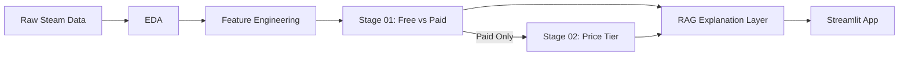

# **🎮 STEAM PRICE INTELLIGENCE SYSTEM**

An end-to-end machine learning project for predicting Steam game pricing strategy using only pre-release information.

This project is built as a two-stage pricing pipeline:

1. Stage 01 predicts whether a game is `Free` or `Paid`
2. Stage 02 predicts the paid game's price tier: `budget`, `low`, `mid`, or `premium`
3. A RAG-style explanation layer retrieves supporting signals and similar historical games
4. A Streamlit app exposes the full pipeline through an interactive UI

## **Project Goal**

Pricing is one of the most important decisions for indie and mid-scale game developers. Many games are launched with little data support behind pricing choices, which can lead to:

- underpricing and lost revenue
- overpricing and weak conversion
- inconsistent pricing relative to game scope, audience, and market expectations

This project turns Steam metadata and short descriptions into a practical decision-support system for pricing strategy.

## **Dataset Summary**

Used Dataset : **"games_march2025_cleaned.csv"**  
Link : [Steam Games Dataset 2025](https://www.kaggle.com/datasets/artermiloff/steam-games-dataset)

The analysis in `01_EDA.ipynb` highlights:

- 94,948 game records
- 47 original features
- mixed numerical, boolean, categorical, and text fields
- strongly right-skewed pricing distribution
- around 15.8% free games
- most games priced below $10

The project uses only pre-release signals for modeling to avoid leakage from post-release behavior.

## **End-to-End Pipeline**



## **Notebook Flow**

### 1. `01_EDA.ipynb`

Exploratory data analysis to understand:

- missing values
- duplicate checks
- price distribution
- free-to-play keyword leakage
- platform and metadata patterns
- early business insights about Steam pricing behavior

### 2. `02_Feature_Engineering.ipynb`

Transforms the raw dataset into a model-ready dataset by:

- removing high-null and leakage-prone columns
- creating `release_year`, `is_free`, and `price_category`
- parsing and encoding genres, tags, and categories
- engineering developer and publisher presence signals
- log-transforming skewed numeric variables
- exporting the processed feature dataset

Price tiers are defined as:

- `free`: $0.00
- `budget`: $0.01 to $0.99
- `low`: $1.00 to $4.99
- `mid`: $5.00 to $9.99
- `premium`: above $9.99

### 3. `03_Stage1_Binary_Classification_free_vs_paid.ipynb`

Builds the first-stage classifier using:

- leakage-aware text cleaning
- temporal train/validation/test splitting
- structured features plus TF-IDF text features
- Logistic Regression, Random Forest, XGBoost, and LightGBM
- PR-AUC-based threshold optimization
- Platt scaling calibration

Final Stage 01 outcome:

- model: Calibrated LightGBM
- ROC-AUC: about 0.91
- PR-AUC: about 0.67
- F1 score: about 0.65
- strong free-game recall in an imbalanced setting

### 4. `04_Stage2_Multiclass_Price_tier.ipynb`

Builds the paid-game price tier classifier using:

- paid-game subset only
- the same engineered structured features
- the same cleaned TF-IDF description features
- multiclass LightGBM
- hyperparameter tuning comparison
- calibration analysis
- permutation importance

Final Stage 02 outcome:

- model: Base LightGBM
- accuracy: about 0.45
- macro F1: about 0.42
- ROC-AUC (OVR): about 0.70

The notebook shows that adjacent tiers are naturally harder to separate because price bands overlap in real-world Steam data.

### 5. `05_Rag_Explanation.ipynb`

Adds the final explanation layer by:

- loading the saved Stage 01 and Stage 02 artifacts
- preparing user input in the same training feature format
- predicting free vs paid and price tier
- extracting active signals from genres, tags, categories, and metadata
- retrieving explanation snippets from a lightweight knowledge base
- retrieving similar historical Steam games using TF-IDF and cosine similarity

This turns the project into a complete pricing decision-support pipeline rather than just a prediction model.

## **Streamlit App**

The project includes a Streamlit interface in `app.py`.

Main features:

- manual user input for game metadata
- notebook-style example presets
- Stage 01 free vs paid prediction
- Stage 02 paid price-tier prediction
- explanation text generated from the RAG layer
- similar historical game retrieval
- visibility into prepared model features

Run locally:

```bash
pip install -r requirements.txt
streamlit run app.py
```

## **Repository Structure**

```text
steam-price-intelligence-system/
├── app.py
├── requirements.txt
├── data/
│   ├── raw/
│   └── processed/
├── notebooks/
│   ├── 01_EDA.ipynb
│   ├── 02_Feature_Engineering.ipynb
│   ├── 03_Stage1_Binary_Classification_free_vs_paid.ipynb
│   ├── 04_Stage2_Multiclass_Price_tier.ipynb
│   ├── 05_Rag_Explanation.ipynb
│   ├── model01_artifacts/
│   └── model02_artifacts/
└── visualizations/
```

## **Saved Artifacts**

Stage 01 artifacts in `notebooks/model01_artifacts/`:

- `model_stage1.pkl`
- `scaler.pkl`
- `tfidf.pkl`
- `threshold.pkl`
- `feature_config.pkl`

Stage 02 artifacts in `notebooks/model02_artifacts/`:

- `model_stage2.pkl`
- `scaler.pkl`
- `tfidf.pkl`
- `labelencoder.pkl`
- `feature_config.pkl`

## **Tech Stack**

- Python
- pandas
- NumPy
- scikit-learn
- LightGBM
- XGBoost
- SciPy
- joblib
- Streamlit
- Jupyter Notebook

## **Installation**

Clone the repository and install dependencies:

```bash
git clone <your-repo-url>
cd steam-price-intelligence-system
pip install -r requirements.txt
```

## **How To Reproduce**

Run the notebooks in this order:

```text
01_EDA.ipynb
02_Feature_Engineering.ipynb
03_Stage1_Binary_Classification_free_vs_paid.ipynb
04_Stage2_Multiclass_Price_tier.ipynb
05_Rag_Explanation.ipynb
```

Then run the app:

```bash
streamlit run app.py
```

## **Git Notes**

This repository is configured to keep large data and work-in-progress files out of Git:

- `data/raw/` is ignored
- `data/processed/` is ignored
- `rough_works/` is ignored
- notebook checkpoints and local environment files are ignored

If someone clones the repo, they will need the dataset files placed back into:

- `data/raw/`
- `data/processed/`

The app and notebooks also expect the saved model artifacts inside:

- `notebooks/model01_artifacts/`
- `notebooks/model02_artifacts/`

## **Key Insights**

- Tags and gameplay-related features are highly informative for free vs paid prediction
- Developer and publisher strength strongly influence paid price-tier prediction
- Language coverage, achievements, and production scale help separate low-tier and premium games
- Price tier prediction is harder than free vs paid because many paid tiers overlap naturally
- The explanation layer improves usability by pairing predictions with interpretable evidence

## **Limitations**

- Stage 02 performance is moderate, especially for adjacent tiers like `budget` vs `low` and `mid` vs `premium`
- The explanation layer uses a static rule-based knowledge base
- Similarity retrieval is TF-IDF-based rather than semantic-embedding-based
- The system does not yet include live market signals such as trends, competition, or regional pricing dynamics

## **Future Work**

- semantic retrieval with sentence embeddings
- LLM-based dynamic explanation generation
- improved class balancing and ensemble methods for Stage 02
- regression-based price recommendation on top of classification
- integration of market competition and trend-aware features

## **Final Takeaway**

This is not just a classification project. It is a practical pricing intelligence workflow that combines:

- predictive modeling
- model calibration
- retrieval-based interpretability
- interactive deployment

The result is a decision-support system that can help developers reason about Steam game pricing before launch.
